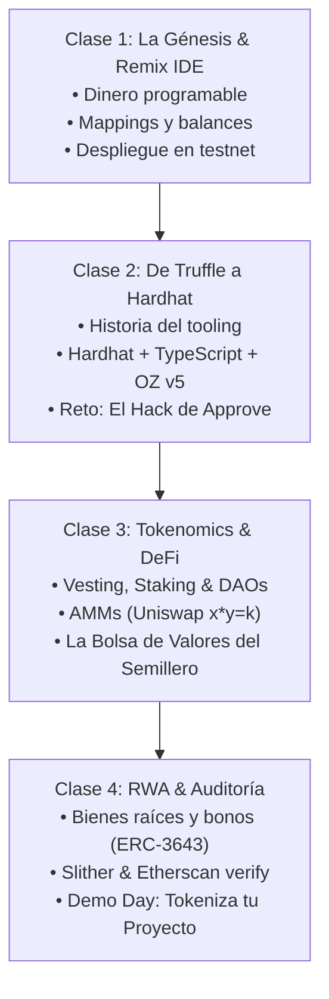

# 🎓 Programa de Formación: Token Master
## De Cero a la Tokenización de la Economía Real con la EVM

> **Semillero de Investigación en Blockchain — Universidad de Antioquia (UdeA)**  
> **Diseñado y Conducido por:** La Alquimia  
> **Modalidad:** Teórico-Práctica Intensiva (30% Conceptos / 70% Live Coding & Desafíos Gamificados)  
> **Duración:** 4 Sesiones Magistrales e Interactivas

---

## 🎯 Filosofía del Curso

Aprender desarrollo Web3 no debe limitarse a mirar diapositivas o copiar código prefabricado. Este programa está estructurado bajo la metodología **"Aprender Construyendo y Rompiendo"**:
- **Exploración Histórica & Evolutiva:** Comprender *por qué* surgieron las herramientas (de los días artesanales de Truffle y Ganache a la modernidad de Hardhat, TypeScript y Foundry).
- **Gamificación en Vivo:** Retos por equipos, dinámicas de "Capture The Ether" (hackeo defensivo de smart contracts) y despliegues colaborativos en testnets.
- **Rigor Industrial:** Aplicación estricta de estándares OpenZeppelin, pruebas unitarias automatizadas y principios de seguridad de nivel de auditoría.

---

## 📅 Estructura de las 4 Clases

---

### 🟢 Clase 1: La Génesis del Dinero Programable & Tu Primer Token en Remix IDE

#### 🧠 Núcleo Conceptual (45 min)
- **Del Libro de Bitcoin al Computador Mundial de Ethereum:** Por qué el modelo UTXO y Script no bastaban para crear tokens universales.
- **La Anatomía de un Token ERC-20:** Qué ocurre bajo el capó en la memoria y el almacenamiento persistente (`mapping(address => uint256)`).
- **La Máquina Virtual de Ethereum (EVM) al Desnudo:** Stack, Memory, Storage y el costo del Gas.

#### 🛠️ Stack Técnico y Herramientas
- **Remix IDE:** El laboratorio interactivo en el navegador. Compilador de Solidity, optimizador, Remix VM local y conexión vía Injected Provider (MetaMask / Rabby).
- **Solidity 0.8+:** Tipos de datos, modificadores de visibilidad (`public`, `external`, `internal`), eventos y reversiones con `require` vs `custom errors`.

#### 🎮 Dinámica Interactiva en Vivo: *"El Gran Airdrop del Semillero"*
1. Los estudiantes escriben desde cero un contrato de token fungible básico sin librerías externas para asimilar cada función.
2. Cada participante conecta su billetera a una Testnet pública (Sepolia o Arbitrum Sepolia) mediante un faucet.
3. Despliegue en vivo: Cada estudiante mintea su propio token institucional y programa una función por lotes (`batchTransfer`) para ejecutar un Airdrop masivo y enviar tokens a todos sus compañeros en el aula en tiempo real.

---

### 🟢 Clase 2: El Ecosistema Profesional: De la Era de Truffle a la Dominancia de Hardhat (y Foundry)

#### 🧠 Núcleo Conceptual (45 min)
- **La Guerra del Tooling en Ethereum:**
  - *La Era de Truffle & Ganache (2017-2020):* Cómo nació la infraestructura moderna y por qué la lentitud de JavaScript y la fragilidad de configuraciones impulsaron la búsqueda de alternativas.
  - *La Revolución de Hardhat:* Soporte nativo para TypeScript, depuración con `console.log` dentro de Solidity, Hardhat Network local con bifurcación de mainnet (*mainnet forking*) y stack traces exactos de errores.
  - *La Nueva Ola con Foundry:* Tests ultrarrápidos escritos directamente en Solidity con Fuzz testing.
- **Arquitectura de OpenZeppelin Contracts v5:** Por qué jamás se debe programar un token crítico desde cero; la función centralizada `_update()` y librerías de control de acceso (`Ownable`, `AccessControl`).

#### 🛠️ Stack Técnico y Herramientas
- **Node.js, Hardhat, TypeScript, Ethers.js / Viem, Chai & Mocha.**
- **OpenZeppelin Contracts v5.**

#### 🎮 Dinámica Interactiva en Vivo: *"El Hack de la Aprobación Infinita (Token Heist)"*
1. **El Escenario:** Se proporciona a los estudiantes un entorno local en Hardhat con un protocolo DeFi vulnerable al clásico ataque de front-running en la mempool de `approve()`.
2. **Ronda de Ataque (Red Team):** Los estudiantes escriben un script en TypeScript que detecta la transacción de cambio de asignación y extrae los fondos previamente autorizados antes de que se confirme la bajada de balance.
3. **Ronda de Defensa (Blue Team):** Los estudiantes refactorizan el contrato implementando el estándar **EIP-2612 (`permit`)** con firmas criptográficas off-chain (EIP-712), erradicando las transacciones dobles y eliminando la vulnerabilidad de raíz.

---

### 🟢 Clase 3: Tokenomics Avanzado, Mecánicas Especiales & Conexión DeFi

#### 🧠 Núcleo Conceptual (45 min)
- **Mecánicas del Mundo Real:**
  - **Vesting y Timelocks:** Cómo proteger a una comunidad de un *rug pull* liberando tokens de fundadores de forma lineal durante 24-48 meses (`VestingWallet`).
  - **Staking y Recompensas:** Modelos matemáticos de distribución de recompensas basados en tiempo de permanencia.
  - **Gobernanza On-Chain:** Tokens de votación con puntos de control temporales (`ERC20Votes`) y su integración con snapshots off-chain.
- **La Conexión con Finanzas Descentralizadas (DeFi):**
  - ¿Cómo cobra valor de mercado un token? La fórmula del Creador de Mercado Automatizado (AMM): $x \cdot y = k$ de Uniswap.
  - El rol crítico del patrón `approve` + `transferFrom` en los Smart Contracts de enrutamiento (Routers).

#### 🛠️ Stack Técnico y Herramientas
- **Hardhat Forking:** Simulación en local de la liquidez real de Uniswap v2 / v3 en Ethereum Mainnet.
- **OpenZeppelin Governance & Finance Extensions.**

#### 🎮 Dinámica Interactiva en Vivo: *"La Bolsa de Valores Descentralizada de la UdeA"*
1. La clase se divide en 4 gremios universitarios (ej: *Token Fotocopias*, *Token Cafetería*, *Token Laboratorios*, *Token Gimnasio*).
2. Cada equipo inyecta liquidez en un pool simulado de Uniswap contra una stablecoin de prueba (USDC de testnet).
3. Dinámica de trading y arbitraje: Los estudiantes ejecutan swaps programáticos mediante scripts y contratos inteligentes intermediarios, observando el *slippage*, el impacto en el precio (*price impact*) y la acumulación de comisiones para los proveedores de liquidez (LPs).

---

### 🟢 Clase 4: Tokenización de Activos del Mundo Real (RWA), Auditoría & Demo Day

#### 🧠 Núcleo Conceptual (45 min)
- **La Frontera Institucional: Tokenización RWA (Real World Assets):**
  - De bonos del tesoro (T-Bills de BlackRock BUIDL) a bienes raíces fraccionados y materias primas.
  - Estándares institucionales y regulados: **ERC-3643** (tokens con identidad verificada on-chain y cumplimiento KYC/AML) y **ERC-4626** (bóvedas de rendimiento interoperables).
  - La necesidad de pausabilidad (`Pausable`) y congelamiento por mandatos legales.
- **Seguridad Defensiva y Auditoría:**
  - Análisis estático de vulnerabilidades con **Slither**.
  - Prevención de reentrancia mediante `ReentrancyGuard` y el patrón Checks-Effects-Interactions (CEI).
  - Verificación formal de código en exploradores (Etherscan / Sourcify).

#### 🛠️ Stack Técnico y Herramientas
- **Slither (Trail of Bits)** para escaneo automatizado de seguridad.
- **Hardhat Verify Plugin** para certificación pública de contratos.

#### 🎮 Dinámica Final: *"Demo Day: Tokeniza tu Proyecto de Ingeniería"*
1. Cada grupo diseña y despliega una solución de tokenización para una necesidad real del campus o del entorno empresarial antioqueño (ej: micro-inversión en paneles solares de la UdeA, créditos académicos fraccionables o tokenización de cupos de parqueadero).
2. Requisitos de aprobación para el Demo:
   - Contrato desplegado y verificado en una red de prueba.
   - Suite de pruebas unitarias en Hardhat con cobertura $>90\%$.
   - Reporte limpio tras ejecutar el analizador de seguridad Slither.
3. Pitch de 3 minutos por equipo ante el Semillero con demostración funcional de transferencia e interacción en la dApp.

---

## 📚 Materiales de Apoyo y Prerrequisitos
- Conocimientos básicos de lógica de programación (JavaScript/Python/C++).
- Editor de código: Visual Studio Code o Cursor con extensiones de Solidity y Hardhat.
- Billetera Web3: MetaMask instalada en el navegador.
- Monografía de referencia del Semillero: [`reporte_erc20.md`](./reporte_erc20.md).
- Diapositivas interactivas de apoyo: [`presentacion_erc20.html`](./presentacion_erc20.html).
