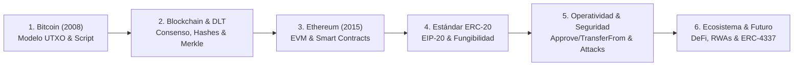

# 🏛️ Evolución de la Programabilidad Descentralizada y Estándar ERC-20

> **Material de Cátedra e Investigación Técnica**  
> **Semillero de Investigación en Blockchain — Universidad de Antioquia (UdeA)**  
> **Laboratorio Financiero UdeA** (Bloque 19, Aula 206)  
> **Facultad de Ingeniería & Facultad de Ciencias Económicas**  
> Cátedra Conducida por: **La Alquimia**

---

## 📌 Descripción General

Este repositorio reúne la investigación monográfica formal y el material de proyección pedagógico sobre la evolución de las tecnologías de registro distribuido (DLT) y la arquitectura de contratos inteligentes, desde la génesis de Bitcoin hasta la especificación técnica profunda del estándar **ERC-20 (EIP-20)** en la Máquina Virtual de Ethereum (EVM).

El proyecto ha sido concebido como material de referencia académica para estudiantes, investigadores y desarrolladores del **Semillero de Blockchain de la Universidad de Antioquia**, combinando rigor matemático-computacional con análisis de seguridad en producción.

---

## 📂 Contenido del Repositorio

| Archivo | Formato | Descripción |
| :--- | :--- | :--- |
| [`poster_horizontal_udea.html`](./poster_horizontal_udea.html) | HTML5 / CSS Imprimible | **Póster Académico Oficial (Carta Horizontal 11" x 8.5"):** Diseño horizontal condensado de alta fidelidad, con los 4 módulos secuenciales, flujos de arquitectura, snippets Solidity, QR escaneable y estilo institucional UdeA. |
| [`poster_horizontal_udea.pdf`](./poster_horizontal_udea.pdf) | PDF Vectorial (11" x 8.5") | **Documento PDF Imprimible Tamaño Carta Horizontal:** Exportación vectorial de 1 sola página a 300 DPI con tipografía nítida y seleccionable. |
| [`poster_horizontal_udea.png`](./poster_horizontal_udea.png) | Imagen PNG (2816 x 2176 px) | **Imagen de Alta Resolución Retina (Proporción Carta Horizontal):** Afiche condensado listo para difusión digital, redes sociales, pantallas y carteleras. |
| [`poster_clase_udea.html`](./poster_clase_udea.html) | HTML5 / CSS Imprimible | **Afiche Publicitario y Poster Académico Vertical:** Formato vertical de alta resolución (proporción publicitaria y A4 imprimible con `@media print`) para la sesión del Semillero UdeA conducida por La Alquimia (Viernes 2:00 PM – 4:00 PM · Laboratorio Financiero UdeA 19-206 · Despliegue en Testnet & Mainnet · Asistencia con IA). |
| [`reporte_erc20.md`](./reporte_erc20.md) | Markdown | **Monografía Técnica Completa (50+ KB):** Cronología evolutiva (Bitcoin, DLT, Ethereum, EVM), ontología de cuentas, especificación formal del estándar ERC-20, interfaces Solidity documentadas en NatSpec, vectores de ataque en mempool, desbordamientos, reentrancia y estándares complementarios. |
| [`presentacion_erc20.html`](./presentacion_erc20.html) | HTML5 / Vanilla JS | **Diapositivas Interactivas Universitarias (130+ KB):** Presentación autocontenida de 21 diapositivas con glassmorphismo institucional, degradado ambiental dinámico, arquitectura completa de emisión/quema (mint y burn), estándares ERC-20/721/1155/4626/3643 y convocatoria al taller presencial en el Laboratorio Financiero UdeA (Bloque 19-206). |
| [`CURSO_TOKENIZACION.md`](./CURSO_TOKENIZACION.md) | Markdown | **Programa Formativo Intensivo (4 Clases):** Diseño pedagógico gamificado y práctico para el Semillero UdeA en el Laboratorio Financiero UdeA 19-206 (Viernes 2:00 PM – 4:00 PM) enfocado en live coding, despliegue en Testnet/Mainnet y tokenización RWA (NO requiere saber programar ni traer laptop). |

---

## 🖥️ Cómo Visualizar las Diapositivas (`presentacion_erc20.html`)

El archivo es **100% autocontenido** (no requiere instalar paquetes de Node.js ni configurar servidores web complejos).

### Opción 1: Apertura Directa
Haz doble clic sobre el archivo `presentacion_erc20.html` o ábrelo directamente desde tu navegador preferido (Chrome, Firefox, Safari, Edge, Brave).

### Opción 2: Servidor Local Rápido (Opcional)
Si deseas servirlo localmente mediante terminal:
```bash
# Con Python 3
python3 -m http.server 8000

# O con npx
npx serve .
```
Luego ingresa en tu navegador a: `http://localhost:8000/presentacion_erc20.html`

---

## ⌨️ Controles de Navegación de la Presentación

- **Avanzar Diapositiva:** `Flecha Derecha`, `Barra Espaciadora` o `AvPág`.
- **Retroceder Diapositiva:** `Flecha Izquierda` o `RePág`.
- **Inicio / Fin:** Teclas `Home` (primera diapositiva) y `End` (última diapositiva).
- **Modo Pantalla Completa:** Presiona `F` para activar o desactivar la vista completa para proyector.
- **Vista en Cuadrícula / Índice:** Presiona `O` o `Esc` para abrir el selector rápido de diapositivas.
- **Menú de Ayuda:** Presiona `?` en cualquier momento.
- **Dispositivos Móviles y Tablets:** Desliza el dedo horizontalmente (*swipe*) para cambiar de diapositiva.

---

## 🗺️ Mapa Temático del Reporte y Presentación



1. **Bitcoin y el Dinero Programable:** Resolución del doble gasto, modelo de salidas no gastadas (UTXO) y limitaciones del lenguaje Bitcoin Script.
2. **Fundamentos Criptográficos y de Consenso:** Criptografía asimétrica (ECDSA secp256k1), hashes Keccak-256, árboles Merkle-Patricia y transición de PoW a PoS.
3. **Ethereum y la EVM:** La computadora mundial de Turing, modelo de cuentas (EOA vs Contract Accounts), Trie de almacenamiento y el Gas como solución al Halting Problem.
4. **Génesis y Especificación de ERC-20:** EIP-20, metadatos, funciones obligatorias (`totalSupply`, `balanceOf`, `transfer`, `approve`, `allowance`, `transferFrom`) y eventos indexados en el Bloom filter.
5. **Flujos Operativos y Riesgos de Seguridad:** Transferencia directa vs delegada, condiciones de carrera en mempool (front-running de approve), SafeMath vs Solidity 0.8+, patrones Checks-Effects-Interactions y arquitectura OpenZeppelin v5.
6. **Ecosistema y Horizontes Futuros:** Integración en DeFi, DAOs y RWAs; matriz comparativa (ERC-721, ERC-1155, ERC-4626) y abstracción de cuentas (ERC-4337).

---

## 🏛️ Créditos y Licencia

- **Institución:** Universidad de Antioquia (UdeA) — Medellín, Colombia.
- **Grupo:** Semillero de Investigación en Blockchain.
- **Autoría Técnica:** **La Alquimia**.
- **Licencia:** MIT License. Material de libre consulta, divulgación académica y desarrollo formativo.
