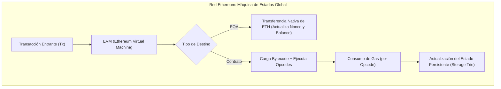
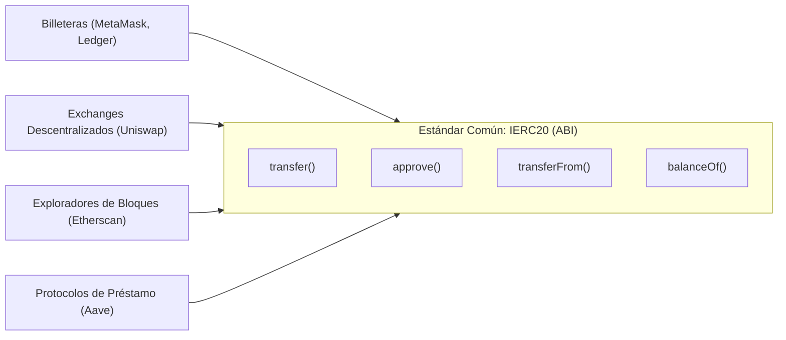
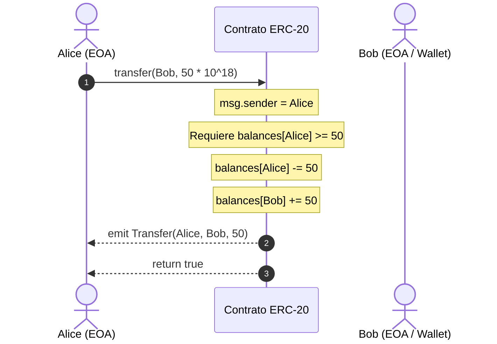
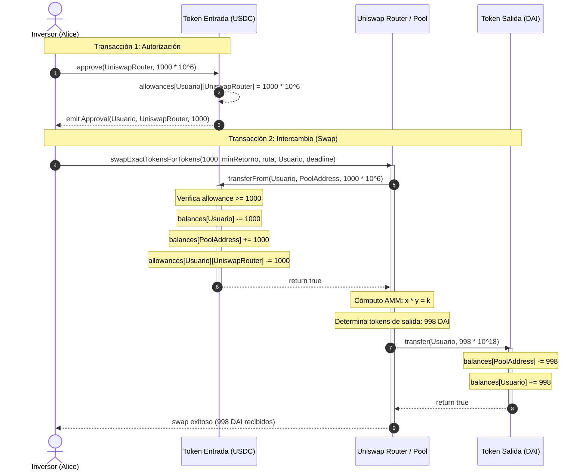
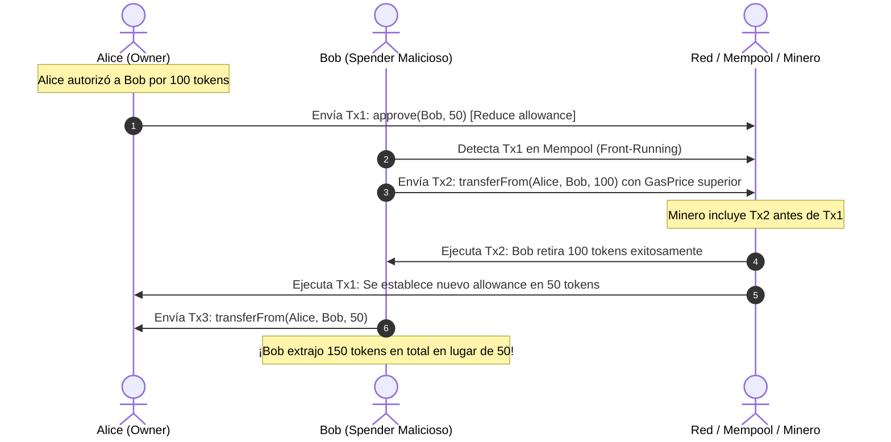
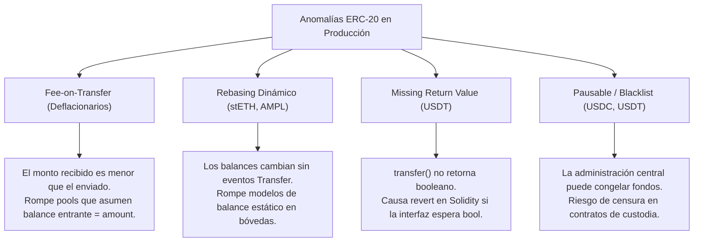
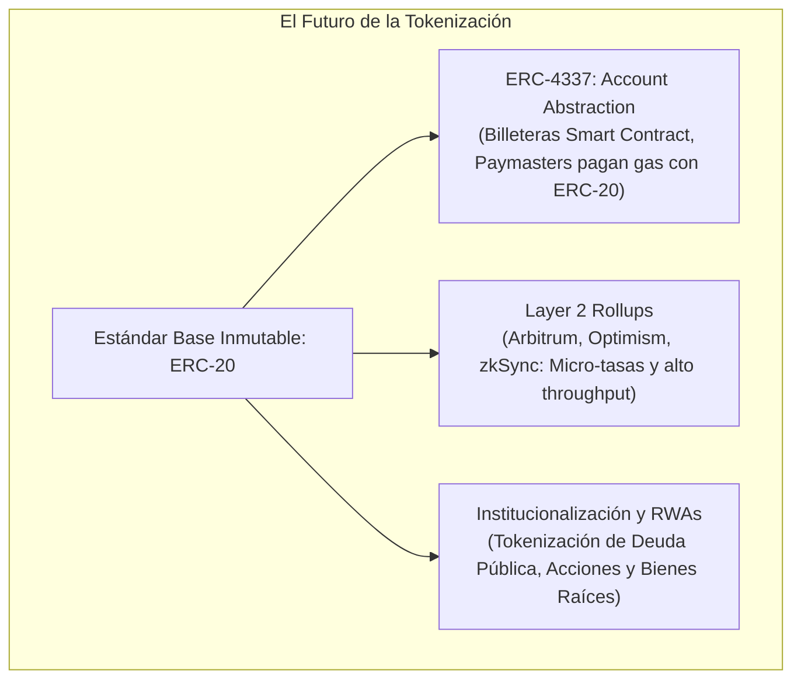

# REPORTE TÉCNICO EXHAUSTIVO: EL ESTÁNDAR ERC-20 Y LA EVOLUCIÓN DE LOS TOKENS EN BLOCKCHAIN

**Autor:** Agente 1 — Investigador y Redactor Técnico Blockchain  
**Fecha:** Septiembre de 2026  
**Clasificación:** Documento Técnico / Arquitectura de Software Descentralizado  
**Objetivo:** Análisis integral de la evolución histórica, fundamentación criptográfica, especificación técnica, vectores de ataque, mejores prácticas y aplicaciones del estándar ERC-20 en la máquina virtual de Ethereum (EVM).

---

## TABLA DE CONTENIDOS

1. [Introducción y Cronología Evolutiva](#1-introducción-y-cronología-evolutiva)
   - 1.1 Bitcoin (2008-2009): La Génesis del Efectivo P2P y el Modelo UTXO
   - 1.2 Limitaciones de Bitcoin Script y la Necesidad de Computación General
   - 1.3 Blockchain y Tecnologías de Libro Mayor Distribuido (DLT)
   - 1.4 Ethereum (2013-2015): La Computadora Mundial Descentralizada
   - 1.5 Arquitectura de la EVM: Cuentas, Gas y Máquinas de Estado
2. [El Nacimiento de ERC-20](#2-el-nacimiento-de-erc-20)
   - 2.1 Contexto Histórico: EIP-20 y sus Creadores
   - 2.2 Moneda Nativa (ETH) vs. Tokens Basados en Contratos Inteligentes
   - 2.3 Concepto y Mecánica de la Fungibilidad
   - 2.4 La Estandarización como Catalizador de Ecosistemas (ICOs, DEXs, Wallets)
3. [Especificación Técnica del Estándar ERC-20](#3-especificación-técnica-del-estándar-erc-20)
   - 3.1 Métodos Opcionales de Metadatos y el Paradigma de Decimales
   - 3.2 Métodos Requeridos de Lectura (View Functions)
   - 3.3 Métodos Requeridos de Mutación y Transferencia
   - 3.4 Sistema de Eventos, Opcodes de Logs y Mecanismos de Indexación
   - 3.5 Interfaz Oficial Comentada: `IERC20.sol`
4. [Patrones de Interacción y Flujos Operativos](#4-patrones-de-interacción-y-flujos-operativos)
   - 4.1 Flujo de Transferencia Directa (`transfer`) y sus Limitaciones
   - 4.2 Flujo de Transferencia Delegada: El Patrón `approve` / `transferFrom`
   - 4.3 Anatomía de una Interacción con Protocolos DeFi (Ejemplo: Uniswap)
   - 4.4 El Problema de las Aprobaciones Infinitas (*Infinite Allowance*)
5. [Seguridad, Vulnerabilidades y Mejores Prácticas](#5-seguridad-vulnerabilidades-y-mejores-prácticas)
   - 5.1 La Condición de Carrera en `approve` (Front-Running Attack) y Soluciones
   - 5.2 Desbordamientos Aritméticos: De SafeMath a Solidity 0.8+
   - 5.3 Ataques de Reentrancia y el Patrón Checks-Effects-Interactions (CEI)
   - 5.4 Variantes y Anomalías en Producción (Fee-on-transfer, Rebasing, Pausable/Blacklist, Missing Return Values)
   - 5.5 Implementación de Referencia de la Industria: OpenZeppelin ERC20
6. [Impacto en el Ecosistema y Evolución](#6-impacto-en-el-ecosistema-y-evolución)
   - 6.1 Casos de Uso Primordiales: DeFi, DAOs, Stablecoins y RWA
   - 6.2 Comparativa con Estándares Sucesores y Complementarios (ERC-721, ERC-1155, ERC-777, ERC-4626)
   - 6.3 Conclusiones y el Futuro de los Tokens (ERC-4337, Account Abstraction y L2s)

---

## 1. INTRODUCCIÓN Y CRONOLOGÍA EVOLUTIVA

### 1.1 Bitcoin (2008-2009): La Génesis del Efectivo P2P y el Modelo UTXO

En octubre de 2008, bajo el seudónimo de Satoshi Nakamoto, se publicó el documento fundacional *"Bitcoin: A Peer-to-Peer Electronic Cash System"*. La propuesta abordó uno de los problemas históricos más complejos de las ciencias de la computación distribuida: **el problema del doble gasto** (*double-spending problem*) sin recurrir a una entidad central de compensación o confianza.

```
       CONCEPCIÓN DE BITCOIN (2008-2009)
+--------------------------------------------------------+
|  Emisión Descentralizada + Red P2P + Registro Global   |
|                 (Proof of Work)                        |
+--------------------------------------------------------+
                           |
                           v
              MODELO DE TRANSACCIÓN UTXO
 [TX_0 Input] ---> [ScriptSig]
                   [ScriptPubKey] ---> UTXO 1 (0.5 BTC) -> Bloqueado a Alice
                                  ---> UTXO 2 (1.5 BTC) -> Vuelto a Bob
```

El diseño de Bitcoin se basó en el modelo **UTXO (Unspent Transaction Output)**:
- El estado del sistema no mantiene balances o saldos globales por usuario.
- El libro contable es un grafo acíclico dirigido (DAG) de transacciones donde cada transacción consume una o más salidas no gastadas previas (UTXO) y genera nuevas salidas no gastadas.
- Cada UTXO está custodiado por un script criptográfico de bloqueo (*ScriptPubKey*), el cual solo puede ser consumido por quien presente un script de desbloqueo válido (*ScriptSig* o datos del testigo *Witness*), comúnmente una firma digital bajo la curva elíptica secp256k1.

### 1.2 Limitaciones de Bitcoin Script y la Necesidad de Computación General

Para garantizar la máxima seguridad y determinismo, Nakamoto diseñó **Bitcoin Script**, un lenguaje de ejecución basado en pila (*stack-based*), interpretado linealmente y deliberadamente **no Turing-completo**:
1. **Ausencia de Bucles (*Loops*):** Carece de instrucciones como `FOR` o `WHILE` para evitar bucles infinitos y garantizar que el tiempo de validación de una transacción sea estrictamente predecible ($O(n)$ respecto al tamaño del script).
2. **Ceguera de Estado (*State-blindness*):** Una UTXO solo tiene dos estados posibles: gastada o no gastada. Un script no puede mantener variables de estado que persistan entre transacciones ni inspeccionar el contexto global de la blockchain (por ejemplo, el balance total de otros usuarios o datos de oráculos externos).
3. **Falta de Abstracción de Contratos:** La creación de contratos complejos, canales de pago de estados arbitrarios o la emisión de activos digitales secundarios exigía trucos sobrecargados (como el opcode `OP_RETURN` utilizado por protocolos como Omni Layer / Mastercoin para emitir los primeros Tether USDT).

Esta rigidez protegió a Bitcoin como reserva de valor y medio de liquidación pura, pero dejó vacante un espacio crucial: una red capaz de computar cualquier algoritmo distribuido con persistencia de estado arbitraria.

### 1.3 Blockchain y Tecnologías de Libro Mayor Distribuido (DLT)

Una blockchain es una estructura de datos secuencial compuesta por bloques vinculados criptográficamente, replicada a través de una red peer-to-peer mediante protocolos de consenso. Sus pilares fundamentales son:

```
        ESTRUCTURA DE BLOQUES Y ÁRBOLES DE MERKLE
+-------------------------------------------------------------+
| BLOQUE N-1                                                  |
| Hash: 000000a1...                                           |
+-------------------------------------------------------------+
                             ^
                             | (Hash del bloque previo)
+-------------------------------------------------------------+
| BLOQUE N (Cabecera + Cuerpo)                                |
| - Previous Block Hash: 000000a1...                          |
| - Timestamp: 1715000000                                     |
| - Nonce / MixHash / Slot                                    |
| - Merkle / Patricia Root: [Raíz de Estado y Transacciones]   |
|                                                             |
|           [Raíz de Merkle]                                  |
|              /         \                                    |
|         H(AB)           H(CD)                               |
|        /    \          /    \                               |
|      H(A)   H(B)     H(C)   H(D)                            |
|       |      |        |      |                              |
|     Tx A   Tx B     Tx C   Tx D                             |
+-------------------------------------------------------------+
```

1. **Criptografía Asimétrica:** Generación de pares de claves pública/privada (comúnmente ECDSA sobre secp256k1). La clave privada firma transacciones; la clave pública (o su hash truncado) conforma la dirección accesible de destino.
2. **Funciones Hash Criptográficas (SHA-256 / Keccak-256):** Funciones unidireccionales, deterministas, con resistencia a colisiones y efecto avalancha. Cualquier alteración mínima en una transacción cambia por completo el hash del bloque y de todos los bloques subsecuentes, otorgando **inmutabilidad estricta**.
3. **Árboles de Merkle / Merkle Patricia Trees:** Estructuras que permiten verificar la inclusión e integridad de transacciones con complejidad $O(\log n)$ mediante pruebas criptográficas compactas (*Merkle Proofs*).
4. **Mecanismos de Consenso:**
   - **Proof of Work (PoW):** Resolución computacionalmente costosa de un rompecabezas hash (encontrar un *nonce* tal que $\text{Hash}(\text{Header}) < \text{Target}$). La seguridad proviene del gasto energético y la potencia de cálculo acumulada.
   - **Proof of Stake (PoS):** Los validadores inmovilizan capital nativo (*stake* de 32 ETH en Ethereum post-The Merge) para proponer y atestiguar bloques. El consenso (como Casper FFG + LMD GHOST) reemplaza la quema de energía física por penalizaciones económicas severas (*slashing*) en caso de comportamiento malicioso o firmas dobles.

### 1.4 Ethereum (2013-2015): La Computadora Mundial Descentralizada

A finales de 2013, Vitalik Buterin publicó el *Ethereum Whitepaper*, planteando una plataforma de contratos inteligentes con un lenguaje de programación integrado y Turing-completo. Formalizado matemáticamente por Gavin Wood en 2014 a través del *Yellowpaper*, Ethereum no buscó ser únicamente una moneda alternativa, sino una **máquina de estados global compartida y programable**: la **Ethereum Virtual Machine (EVM)**.



### 1.5 Arquitectura de la EVM: Cuentas, Gas y Máquinas de Estado

A diferencia del modelo UTXO de Bitcoin, Ethereum adoptó el **Modelo Basado en Cuentas (*Account-based Model*)**. El estado global es un mapeo entre direcciones (de 160 bits / 20 bytes) y estados de cuenta:

$$\sigma[\text{address}] = (\text{nonce}, \text{balance}, \text{storageRoot}, \text{codeHash})$$

Existen dos tipos de cuentas en la EVM:
1. **Externally Owned Accounts (EOAs):** Cuentas controladas por personas u operadores mediante claves privadas. No poseen código (`codeHash = keccak256("")`). Pueden originar transacciones.
2. **Contract Accounts:** Cuentas controladas por código de bytecode inmutable alojado en la blockchain. Poseen almacenamiento propio persistente (`storageRoot`) y código ejecutable (`codeHash`). Solo reaccionan cuando reciben una llamada (*message call*) detonada por una EOA o por otro contrato.

#### El Paradigma del Gas y el Problema de la Parada
Al ser la EVM una máquina **Turing-completa**, es susceptible al **Problema de la Parada** (*Halting Problem*, Alan Turing, 1936): es formalmente imposible determinar a priori si un programa arbitrario terminará o correrá indefinidamente en un bucle infinito.

Para evitar ataques de Denegación de Servicio (DoS) y el secuestro indefinido de los recursos de los nodos validadores, Ethereum implementó el concepto de **Gas**:
- Cada instrucción elemental (opcode EVM: `ADD`, `SSTORE`, `SLOAD`, `KECCAK256`, etc.) tiene un costo determinista prefijado en unidades de gas.
- El originador de la transacción define un `gasLimit` (la cantidad máxima de gas dispuesta a gastar) y un precio de gas (`gasPrice` / `baseFee` + `priorityFee` bajo EIP-1559).
- Si el gas asignado se agota durante la ejecución, la EVM lanza una excepción `OutOfGas`, **revirtiendo todos los cambios de estado** efectuados en esa transacción, pero reteniendo el gas consumido como compensación para el validador que procesó el cómputo.

---

## 2. EL NACIMIENTO DE ERC-20

### 2.1 Contexto Histórico: EIP-20 y sus Creadores

En los primeros meses tras el lanzamiento de Ethereum en 2015, los desarrolladores comenzaron a implementar contratos que representaban monedas, participaciones o fichas digitales. Sin embargo, cada programador nombraba sus variables y funciones a discreción:

```solidity
// Antes de la estandarización: una pesadilla de incompatibilidad
contract TokenDeAlice {
    function sendCoin(address to, uint256 val) public returns (bool) { ... }
    function coinBalance(address who) public view returns (uint256) { ... }
}

contract TokenDeBob {
    function transferTokens(address receiver, uint256 amount) public { ... }
    function checkFunds(address owner) public view returns (uint256) { ... }
}
```

El 19 de noviembre de 2015, **Fabian Vogelsteller** y **Vitalik Buterin** abrieron el issue #20 en el repositorio GitHub de EIPs (*Ethereum Improvement Proposals*), proponiendo una interfaz estandarizada para tokens fungibles. Tras iteraciones técnicas y debates comunitarios, la propuesta fue formalizada como el estándar **EIP-20 / ERC-20** (*Ethereum Request for Comments 20*).

```
  19 Nov 2015                 2016-2017                   2017-2018                  Presente
       |                          |                           |                          |
       v                          v                           v                          v
  EIP-20 abierto           Adopción por Wallets        Boom de las ICOs           Estándar Rector
  (Fabian & Vitalik)       (Mist, MetaMask, MEW)      (Centenares de miles      DeFi, Stablecoins,
                                                      de tokens emitidos)         RWAs globales
```

### 2.2 Moneda Nativa (ETH) vs. Tokens Basados en Contratos Inteligentes

Es vital distinguir ontológicamente entre el activo nativo de la red y los tokens secundarios:

| Dimensión | Moneda Nativa (Ether - ETH) | Token de Contrato (ERC-20) |
| :--- | :--- | :--- |
| **Nivel Arquitectónico** | Capa 1 (Capa de Consenso y Protocolo base) | Capa 2 / Aplicación (Bytecode EVM) |
| **Almacenamiento** | Campo nativo `balance` en la cuenta de la EVM | Entrada en un `mapping(address => uint256)` en el Storage del contrato |
| **Transferencia** | Instrucción nativa de transferencia / Opcode `CALL` con valor `msg.value` | Ejecución de la función `transfer()` o `transferFrom()` mediante transacción a la dirección del contrato |
| **Manejo de Gas** | Es el combustible requerido para pagar el cómputo de la EVM | No puede pagar gas directamente (salvo mediante Account Abstraction / Paymasters) |
| **Envío a Contratos** | Dispara funciones `receive()` o `fallback()` en el receptor | Solo interactúa con el contrato del token, el receptor no se entera a menos que se usen hooks |

> [!NOTE]
> Cuando un usuario transfiere un token ERC-20, **no envía datos a la dirección del receptor**, sino que envía una transacción dirigida al contrato inteligente del token, invocando una función que descuenta el número de su saldo interno y lo acredita en el saldo del receptor.

### 2.3 Concepto y Mecánica de la Fungibilidad

Un activo es **fungible** cuando cada una de sus unidades es matemáticamente idéntica, intercambiable e indistinguible de cualquier otra unidad del mismo tipo y denominación.
- 1 unidad de token $A$ en la cuenta de Alice posee exactamente las mismas propiedades, liquidez y valor que 1 unidad de token $A$ en la cuenta de Bob.
- A diferencia del dinero físico (cuyos billetes poseen números de serie rastreables), en el contrato ERC-20 los balances son únicamente números enteros en un mapeo. No existe un "token individual con historial propio"; solo existe una cifra contable agregada por dirección.

### 2.4 La Estandarización como Catalizador de Ecosistemas

La adopción de una Interfaz de Aplicación Binaria (ABI) unificada permitió desacoplar a los creadores de software del emisor de cada activo:



1. **Billeteras (*Wallets*):** Aplicaciones como MetaMask, Ledger o Rainbow pudieron programar una única interfaz visual para consultar saldos y despachar transferencias para cualquier token ERC-20 existente o futuro con solo conocer su dirección (`address`).
2. **Exchanges Centralizados (CEXs):** Plataformas como Coinbase o Binance automatizaron el soporte para depósitos y retiros reduciendo el tiempo de integración de semanas a minutos.
3. **El Boom de las ICOs (2017-2018):** Cualquier proyecto pudo desplegar un contrato de financiamiento colectivo (*Initial Coin Offering*) y distribuir tokens que inmediatamente cotizaban en mercados secundarios.
4. **Finanzas Descentralizadas (DeFi):** Hizo viable el nacimiento de Creadores de Mercado Automatizados (*Automated Market Makers* - AMMs) como Uniswap, que operan pares de liquidez genéricos sin importar el proyecto subyacente.

---

## 3. ESPECIFICACIÓN TÉCNICA DEL ESTÁNDAR ERC-20

### 3.1 Métodos Opcionales de Metadatos y el Paradigma de Decimales

Aunque el estándar EIP-20 no los exige para la validez formal del contrato a nivel de consenso, define tres métodos de lectura de metadatos indispensables para la interfaz de usuario:

```solidity
function name() public view returns (string);
function symbol() public view returns (string);
function decimals() public view returns (uint8);
```

#### El Dilema de la Aritmética de Punto Fijo en la EVM
La EVM es una máquina que **únicamente procesa números enteros sin signo o con signo (`uint256`, `int256`)**. No existe el tipo de dato de coma flotante (`float` o `double`) para garantizar que la ejecución matemática sea 100% determinista en miles de procesadores y arquitecturas de hardware diferentes (evitando discrepancias por el estándar IEEE 754).

Para manejar fracciones, las monedas dividen una unidad entera en submúltiplos mediante la función `decimals()`:
- Si un token define `decimals() = 18`, una unidad visible para el usuario ($1.0 \text{ TOKEN}$) equivale en el almacenamiento interno a $1 \times 10^{18}$ unidades base (similares a los Wei en Ether).
- Si un token define `decimals() = 6` (como USDC o USDT), una unidad visible ($1.0 \text{ USDC}$) equivale a $1 \times 10^6 = 1,000,000$ unidades base.

```
       CONVERSIÓN DE DECIMALES EN LA EVM
+----------------------------------------------------------------+
| Representación Humana: 15.5 DAI                                |
| Factor de Escala (18 decimales): 10^18                          |
| Valor en Almacenamiento (uint256):                             |
| 15,500,000,000,000,000,000 (15.5 * 10^18)                     |
+----------------------------------------------------------------+
```

> [!WARNING]
> Olvidar la escala de `decimals()` al interactuar directamente con contratos inteligentes es una fuente común de errores críticos. Transferir `100` unidades a un contrato con 18 decimales transfiere $100 \times 10^{-18}$ tokens (una fracción infinitesimal), no 100 tokens reales.

### 3.2 Métodos Requeridos de Lectura (View Functions)

Funciones que consultan el estado del contrato sin modificar el almacenamiento, ejecutándose localmente sin costo de gas cuando se llaman vía RPC (`eth_call`):

```solidity
function totalSupply() external view returns (uint256);
function balanceOf(address account) external view returns (uint256);
```

1. **`totalSupply()`**: Retorna la cantidad agregada de tokens en circulación en unidades base. La invariante de conservación monetaria dicta que:
   $$\text{totalSupply} = \sum_{i=1}^{N} \text{balanceOf}(\text{address}_i)$$
2. **`balanceOf(address account)`**: Lee directamente el valor asignado a la dirección solicitada en el almacenamiento del contrato (`mapping(address => uint256) private _balances`).

### 3.3 Métodos Requeridos de Mutación y Transferencia

Funciones que alteran el estado persistente de la blockchain, requiriendo una transacción firmada, cómputo en los nodos y pago de gas:

```solidity
function transfer(address recipient, uint256 amount) external returns (bool);
function allowance(address owner, address spender) external view returns (uint256);
function approve(address spender, uint256 amount) external returns (bool);
function transferFrom(address sender, address recipient, uint256 amount) external returns (bool);
```

- **`transfer(address recipient, uint256 amount)`**: Descuenta `amount` del balance de `msg.sender` y lo añade al balance de `recipient`. Emite el evento `Transfer`.
- **`allowance(address owner, address spender)`**: Consulta el límite de tokens que el propietario (`owner`) ha autorizado al gestor (`spender`) para gastar en su nombre.
- **`approve(address spender, uint256 amount)`**: Modifica el mapeo de asignaciones (`allowances`), autorizando a `spender` a transferir hasta `amount` tokens desde el balance de `msg.sender`. Emite el evento `Approval`.
- **`transferFrom(address sender, address recipient, uint256 amount)`**: Ejecutada por un tercero (`spender`), descuenta `amount` del balance de `sender`, lo acredita a `recipient`, y disminuye el `allowance[sender][msg.sender]` en esa misma cantidad. Emite el evento `Transfer`.

### 3.4 Sistema de Eventos, Opcodes de Logs y Mecanismos de Indexación

El estándar ERC-20 exige dos eventos para mantener sincronizados los clientes fuera de la cadena (*off-chain*):

```solidity
event Transfer(address indexed from, address indexed to, uint256 value);
event Approval(address indexed owner, address indexed spender, uint256 value);
```

```
           ANATOMÍA DE UN LOG DE LA EVM (EVENT TRANSFER)
+--------------------------------------------------------------------------+
| LOG3 (Opcode con 3 topics)                                               |
| - Topic 0: keccak256("Transfer(address,address,uint256)")                |
|            = 0xddf252ad1be2c89b69c2b068fc378daa952ba7f163c4a11628f55a4df523b3ef |
| - Topic 1: address from (padded a 32 bytes)                              |
| - Topic 2: address to   (padded a 32 bytes)                              |
| - Data (no indexada): uint256 value (32 bytes)                           |
+--------------------------------------------------------------------------+
```

#### Fundamento Criptográfico de los Logs y Filtros Bloom
1. **Opcodes `LOG0` a `LOG4`:** La EVM emite registros de eventos mediante opcodes que almacenan hasta 4 "topics" indexables de 32 bytes cada uno.
2. **Costo de Gas Reducido:** Escribir en un Log de evento cuesta aproximadamente 375 gas más 8 gas por byte, frente a los 20,000 gas que cuesta almacenar una nueva ranura (*slot*) en el estado persistente con `SSTORE`. **Los contratos inteligentes no pueden leer los logs en tiempo de ejecución**, pero son ideales para indexación externa.
3. **Filtros Bloom (*Bloom Filters*):** Cada cabecera de bloque contiene un filtro Bloom de 2048 bits derivado de los logs de sus transacciones. Esto permite a librerías como `ethers.js`, `viem` y clientes RPC verificar si un contrato emitió un evento en un bloque en tiempo $O(1)$ sin escanear cada transacción individual.
4. **The Graph (Subgraphs):** Protocolos descentralizados de indexación escuchan los eventos `Transfer` y `Approval` en tiempo real, procesando la información y almacenándola en bases de datos relacionales consultables instantáneamente mediante GraphQL.

### 3.5 Interfaz Oficial Comentada: `IERC20.sol`

A continuación se detalla la interfaz formal basada en la especificación OpenZeppelin v5.0, documentada exhaustivamente bajo el estándar NatSpec:

```solidity
// SPDX-License-Identifier: MIT
pragma solidity ^0.8.20;

/**
 * @title Interfaz Oficial del Estándar ERC-20 (EIP-20)
 * @dev Interfaz formal para contratos que implementan el estándar fungible ERC-20.
 * Conforme a la especificación EIP-20: https://eips.ethereum.org/EIPS/eip-20
 */
interface IERC20 {
    /**
     * @dev Emitido cuando una cantidad de tokens (`value`) es transferida
     * desde una cuenta (`from`) hacia otra (`to`).
     * NOTA: `value` puede ser cero.
     */
    event Transfer(address indexed from, address indexed to, uint256 value);

    /**
     * @dev Emitido cuando la cuenta `owner` autoriza a la cuenta `spender`
     * a gastar hasta `value` tokens en su nombre.
     */
    event Approval(address indexed owner, address indexed spender, uint256 value);

    /**
     * @notice Retorna el número total de tokens emitidos y existentes en circulación.
     */
    function totalSupply() external view returns (uint256);

    /**
     * @notice Retorna el balance de tokens custodiados por la cuenta `account`.
     * @param account Dirección consultada.
     */
    function balanceOf(address account) external view returns (uint256);

    /**
     * @notice Transfiere `value` tokens desde la cuenta que origina la llamada (`msg.sender`)
     * hacia la cuenta de destino `to`.
     * @param to Dirección del receptor.
     * @param value Cantidad de tokens expresada en unidades base.
     * @return bool Retorna `true` si la operación concluyó exitosamente, de lo contrario revierte.
     */
    function transfer(address to, uint256 value) external returns (bool);

    /**
     * @notice Retorna el monto residual que `spender` tiene permitido extraer
     * desde la cuenta de `owner` mediante `transferFrom`.
     * @param owner Propietario de los fondos.
     * @param spender Cuenta autorizada para gastar.
     */
    function allowance(address owner, address spender) external view returns (uint256);

    /**
     * @notice Otorga permiso a la cuenta `spender` para retirar hasta `value` tokens
     * desde la cuenta de quien ejecuta la llamada (`msg.sender`).
     * @param spender Dirección que recibe la autorización.
     * @param value Monto máximo autorizado.
     * @return bool Retorna `true` si la aprobación fue registrada.
     */
    function approve(address spender, uint256 value) external returns (bool);

    /**
     * @notice Transfiere `value` tokens desde la cuenta `from` hacia `to`, descontando
     * dicha cantidad del saldo de asignación (`allowance`) otorgado a `msg.sender`.
     * @dev Requiere que `from` haya autorizado previamente al llamador (`msg.sender`).
     * @param from Cuenta origen de los fondos.
     * @param to Cuenta destino de los fondos.
     * @param value Monto a transferir.
     * @return bool Retorna `true` si la transferencia y deducción de asignación fueron exitosas.
     */
    function transferFrom(address from, address to, uint256 value) external returns (bool);
}
```

---

## 4. PATRONES DE INTERACCIÓN Y FLUJOS OPERATIVOS

### 4.1 Flujo de Transferencia Directa (`transfer`) y sus Limitaciones

El flujo directo es la interacción más intuitiva: Alicia desea transferir 50 tokens a Roberto.



#### La Limitación Fundamental: Ceguera del Contrato Receptor
¿Qué ocurre si Alicia desea depositar 50 tokens en un contrato de Swap descentralizado o de Staking llamando directamente a `token.transfer(contratoDEX, 50)`?
1. La llamada `transfer` se envía **al contrato del token**, no al contrato del DEX.
2. El contrato del token modifica su almacenamiento interno: resta 50 a Alicia y suma 50 al contrato del DEX.
3. **El contrato del DEX nunca es invocado.** No se ejecuta ningún código en la dirección del DEX y su máquina de estados no se entera de que ha recibido fondos ni sabe a favor de qué usuario acreditar la posición. Los fondos quedan varados dentro del contrato sin que el usuario reciba sus tokens de cambio o su crédito de staking.

### 4.2 Flujo de Transferencia Delegada: El Patrón `approve` / `transferFrom`

Para solucionar esta desconexión sin modificar la arquitectura base de la EVM, se diseñó el **patrón de aprobación y transferencia delegada**, el cual opera en dos transacciones separadas y coordinadas.

```
       PATRÓN APPROVE-TRANSFERFROM (DOS FASES)
+-------------------------------------------------------------------------+
| FASE 1: APROBACIÓN                                                      |
| Alice firma Tx 1 -> Token.approve(DEX_Address, 100)                     |
| Estado interno en Token: allowances[Alice][DEX_Address] = 100           |
+-------------------------------------------------------------------------+
                                    |
                                    v
+-------------------------------------------------------------------------+
| FASE 2: EJECUCIÓN Y TRANSFERENCIA DELEGADA                              |
| Alice firma Tx 2 -> DEX.depositOrSwap(100)                              |
| Durante Tx 2:                                                           |
|   DEX invoca internamente -> Token.transferFrom(Alice, DEX, 100)        |
|   Token verifica: allowances[Alice][DEX] >= 100                         |
|   Token descuenta balance de Alice y asigna al DEX                      |
|   Token reduce la asignación: allowances[Alice][DEX] -= 100             |
|   DEX acredita la posición a Alice y entrega contraparte                |
+-------------------------------------------------------------------------+
```

### 4.3 Anatomía de una Interacción con Protocolos DeFi (Ejemplo: Uniswap)

El siguiente diagrama de secuencia desglosa con exactitud matemática y criptográfica la operativa de un intercambio en un pool de liquidez:



### 4.4 El Problema de las Aprobaciones Infinitas (*Infinite Allowance*)

Para evitar que el usuario deba firmar y pagar gas por una transacción `approve` antes de cada intercambio individual, la gran mayoría de las interfaces Web3 sugirieron por años otorgar una aprobación infinita mediante el valor máximo de un entero de 256 bits:

$$\text{Valor Máximo} = 2^{256} - 1 = \text{\texttt{type(uint256).max}}$$
$$\approx 1.15792089237316 \times 10^{77} \text{ tokens}$$

#### El Riesgo Sistémico de Seguridad
Si un contrato inteligente DeFi que tiene una asignación de `type(uint256).max` sobre la billetera de un usuario sufre un exploit o contiene una puerta trasera (*backdoor*):
- El atacante puede invocar `transferFrom(victima, atacante, balanceCompleto)`.
- **Todos los tokens presentes en la billetera de la víctima pueden ser drenados al instante**, incluso meses o años después de que el usuario haya dejado de usar la plataforma.
- **Herramientas de Mitigación:** Servicios como Revoke.cash permiten a los usuarios auditar y revocar asignaciones históricas activas.

---

## 5. SEGURIDAD, VULNERABILIDADES Y MEJORES PRÁCTICAS

### 5.1 La Condición de Carrera en `approve` (Front-Running Attack) y Soluciones

La especificación original de `approve()` posee un vector de ataque cripto-económico documentado tempranamente:



#### Soluciones Técnicas
1. **Resetear a Cero:** Requerir que el usuario primero llame a `approve(spender, 0)` y espere confirmación en bloque antes de asignar el nuevo valor (implementado obligatoriamente por tokens como USDT).
2. **Funciones `increaseAllowance` y `decreaseAllowance`:** En lugar de sobreescribir el valor absoluto, modifican atómicamente el margen de asignación:
   ```solidity
   function increaseAllowance(address spender, uint256 addedValue) public returns (bool) {
       _approve(msg.sender, spender, _allowances[msg.sender][spender] + addedValue);
       return true;
   }
   ```
3. **EIP-2612: Firmas Off-chain con `permit()`:** Permite a los usuarios firmar un mensaje estructurado (EIP-712) fuera de cadena que contiene la autorización. Un tercero o el propio contrato de intercambio reenvía la firma a la blockchain y ejecuta la aprobación y el intercambio en **una sola transacción atómica**.

### 5.2 Desbordamientos Aritméticos: De SafeMath a Solidity 0.8+

Históricamente, los enteros en Solidity se comportaban de forma modular cíclica. Un `uint8` que alcanza el valor 255 y recibe una suma de 1 se convierte en 0 ($255 + 1 \equiv 0 \pmod{256}$).

#### El Famoso Hack de BeautyChain (BEC) en 2018
En 2018, el token BEC sufrió una catástrofe debido a un desbordamiento en la función `batchTransfer`:
```solidity
// Código vulnerable de BeautyChain (BEC)
function batchTransfer(address[] _receivers, uint256 _value) public returns (bool) {
    uint cnt = _receivers.length;
    uint256 amount = uint256(cnt) * _value; // ¡OVERFLOW VULNERABLE!
    require(cnt > 0 && cnt <= 20);
    require(_value > 0 && balances[msg.sender] >= amount);

    balances[msg.sender] = balances[msg.sender] - amount;
    for (uint i = 0; i < cnt; i++) {
        balances[_receivers[i]] = balances[_receivers[i]] + _value;
        Transfer(msg.sender, _receivers[i], _value);
    }
    return true;
}
```
El atacante pasó 2 direcciones y un valor `_value = 0x8000000000000000000000000000000000000000000000000000000000000000`. Al multiplicar por 2, el resultado sobrepasó $2^{256}$, reduciéndose a 0 (`amount = 0`). La validación `balances[msg.sender] >= 0` pasó sin error, y el contrato acreditó números astronómicos de tokens a las dos direcciones, evaporando el valor de mercado del token.

```
       EVOLUCIÓN DEL CONTROL ARITMÉTICO
+--------------------------------------------------------------+
| 2015-2020: Solidity < 0.8                                     |
| Se requería la librería externa `SafeMath` de OpenZeppelin   |
| uint256 c = a.add(b); // Revertía manualmente en desborde   |
+--------------------------------------------------------------+
                               |
                               v
+--------------------------------------------------------------+
| Diciembre 2020: Solidity 0.8.0+                              |
| Chequeo nativo integrado a nivel de compilador.               |
| Cualquier overflow/underflow genera automáticamente un Panic |
| revert.                                                      |
| Uso de `unchecked { ... }` reservado para optimizar gas.     |
+--------------------------------------------------------------+
```

### 5.3 Ataques de Reentrancia y el Patrón Checks-Effects-Interactions (CEI)

Aunque un ERC-20 estándar y puro no entrega el control de ejecución al receptor durante un `transfer`, la inclusión de ganchos (*hooks*), tokens con mecanismos de notificación (como ERC-777) o transferencias de valor nativo (ETH) en contratos de intercambio abre la puerta a la **reentrancia**.

```
    PATRÓN CHECKS-EFFECTS-INTERACTIONS (CEI)
1. CHECKS (Comprobaciones):
   require(balances[msg.sender] >= amount, "Saldo insuficiente");

2. EFFECTS (Modificaciones de estado interno):
   balances[msg.sender] -= amount;
   balances[recipient] += amount;

3. INTERACTIONS (Llamadas externas a otros contratos):
   // Se ejecutan ÚNICAMENTE después de haber consolidado el estado
   externalContract.onNotification(amount);
```

Para mayor protección, las librerías modernas aplican el modificador `nonReentrant` de OpenZeppelin (`ReentrancyGuard`), el cual introduce un bloqueo mutex en almacenamiento para impedir que una función vuelva a entrar en el mismo contexto de ejecución antes de finalizar.

### 5.4 Variantes y Anomalías en Producción

En el ecosistema real existen millones de líneas de código que se desvían de la especificación canónica, generando fallos en protocolos desprevenidos:



1. **Tokens con Comisión de Transferencia (*Fee-on-Transfer*):** Tokens que queman o cobran un impuesto del 1-5% en cada transferencia. Si el contrato de un pool asume que al llamar a `transferFrom(user, pool, 100)` ingresaron exactamente 100 tokens, su contabilidad interna queda desincronizada con el balance real. Solución: medir el balance del contrato receptor antes y después de la transferencia:
   $$\Delta \text{Balance} = \text{balanceOf}(\text{this})_{\text{final}} - \text{balanceOf}(\text{this})_{\text{inicial}}$$
2. **Tokens de Rebase (*Rebasing Tokens*):** Como stETH de Lido o AMPL de Ampleforth. El saldo de los usuarios aumenta o disminuye periódicamente para reflejar rendimientos o ajustes algorítmicos sin emitir eventos `Transfer`.
3. **Omisión del Retorno Booleano (*Missing Return Value*):** El contrato original de USDT (Tether) en la red principal de Ethereum no retorna ningún valor booleano en `transfer` ni en `approve`. Si un contrato compila con la interfaz `IERC20` estándar que espera un `bool`, la decodificación de la ABI falla y la transacción revierte.
   > **Solución Industrial:** Uso de la librería `SafeERC20` de OpenZeppelin, la cual inspecciona los datos crudos de retorno (`bytes memory data`) y tolera transferencias exitosas que no devuelven datos.
4. **Listas Negras (*Blacklistable*) y Pausa (*Pausable*):** Stablecoins permisionadas (como USDC y USDT) poseen funciones administrativas con capacidad de congelar direcciones específicas o congelar la transferencia global del token por requerimientos regulatorios o judiciales.

### 5.5 Implementación de Referencia de la Industria: OpenZeppelin ERC20

OpenZeppelin Contracts es el estándar de oro de la industria. En su versión 5.x, la arquitectura consolidó todas las operaciones de mutación de saldos en una única función interna centralizada: `_update`.

```solidity
// SPDX-License-Identifier: MIT
// OpenZeppelin Contracts (last updated v5.0.0) (token/ERC20/ERC20.sol)
pragma solidity ^0.8.20;

import "./IERC20.sol";
import "./extensions/IERC20Metadata.sol";
import "../../utils/Context.sol";

contract ERC20 is Context, IERC20, IERC20Metadata {
    mapping(address account => uint256) private _balances;
    mapping(address account => mapping(address spender => uint256)) private _allowances;

    uint256 private _totalSupply;
    string private _name;
    string private _symbol;

    constructor(string memory name_, string memory symbol_) {
        _name = name_;
        _symbol = symbol_;
    }

    function name() public view virtual returns (string memory) { return _name; }
    function symbol() public view virtual returns (string memory) { return _symbol; }
    function decimals() public view virtual returns (uint8) { return 18; }
    function totalSupply() public view virtual returns (uint256) { return _totalSupply; }
    function balanceOf(address account) public view virtual returns (uint256) { return _balances[account]; }

    function transfer(address to, uint256 value) public virtual returns (bool) {
        address owner = _msgSender();
        _transfer(owner, to, value);
        return true;
    }

    function allowance(address owner, address spender) public view virtual returns (uint256) {
        return _allowances[owner][spender];
    }

    function approve(address spender, uint256 value) public virtual returns (bool) {
        address owner = _msgSender();
        _approve(owner, spender, value);
        return true;
    }

    function transferFrom(address from, address to, uint256 value) public virtual returns (bool) {
        address spender = _msgSender();
        _spendAllowance(from, spender, value);
        _transfer(from, to, value);
        return true;
    }

    // Funciones internas de control y actualización
    function _transfer(address from, address to, uint256 value) internal {
        if (from == address(0)) revert("ERC20InvalidSender");
        if (to == address(0)) revert("ERC20InvalidReceiver");
        _update(from, to, value);
    }

    /**
     * @dev Función centralizada de mutación de estado en OpenZeppelin v5.
     * Gestiona minting (from == 0), burning (to == 0) y transferencias regulares.
     */
    function _update(address from, address to, uint256 value) internal virtual {
        if (from == address(0)) {
            _totalSupply += value;
        } else {
            uint256 fromBalance = _balances[from];
            if (fromBalance < value) revert("ERC20InsufficientBalance");
            unchecked {
                // Seguro: ya se validó que fromBalance >= value
                _balances[from] = fromBalance - value;
            }
        }

        if (to == address(0)) {
            unchecked {
                _totalSupply -= value;
            }
        } else {
            unchecked {
                // Seguro: el balance agregado nunca superará 2^256 - 1 en condiciones normales
                _balances[to] += value;
            }
        }

        emit Transfer(from, to, value);
    }

    function _approve(address owner, address spender, uint256 value) internal {
        _approve(owner, spender, value, true);
    }

    function _approve(address owner, address spender, uint256 value, bool emitEvent) internal virtual {
        if (owner == address(0)) revert("ERC20InvalidApprover");
        if (spender == address(0)) revert("ERC20InvalidSpender");
        _allowances[owner][spender] = value;
        if (emitEvent) {
            emit Approval(owner, spender, value);
        }
    }

    function _spendAllowance(address owner, address spender, uint256 value) internal virtual {
        uint256 currentAllowance = allowance(owner, spender);
        if (currentAllowance != type(uint256).max) {
            if (currentAllowance < value) revert("ERC20InsufficientAllowance");
            unchecked {
                _approve(owner, spender, currentAllowance - value, false);
            }
        }
    }
}
```

---

## 6. IMPACTO EN EL ECOSISTEMA Y EVOLUCIÓN

### 6.1 Casos de Uso Primordiales: DeFi, DAOs, Stablecoins y RWA

El estándar ERC-20 ha sido la infraestructura sobre la cual se erigió la economía criptográfica moderna, permitiendo capitalizaciones agregadas de cientos de miles de millones de dólares:

```
            ECOSISTEMA ALREDEDOR DE ERC-20
+--------------------------------------------------------------------+
| 1. DEFI (Finanzas Descentralizadas)                                |
|    - Creadores de Mercado Automatizados: Uniswap, Curve, Balancer |
|    - Préstamos y Colateralización: Aave, Compound, MakerDAO       |
|    - Agregadores de Rendimiento: Yearn Finance, Convex             |
+--------------------------------------------------------------------+
| 2. MONEDAS ESTABLES (Stablecoins)                                  |
|    - Respaldadas por Reservas Fiduciarias: USDC (Circle), USDT     |
|    - Cripto-colateralizadas y Descentralizadas: DAI / USDS         |
+--------------------------------------------------------------------+
| 3. DAOs Y GOBERNANZA                                               |
|    - Votación On-Chain: GovernorBravo, OpenZeppelin Governor       |
|    - Votación Gasless Off-Chain: Snapshot (ERC20Votes Checkpoints)|
+--------------------------------------------------------------------+
| 4. RWA (Real World Assets)                                         |
|    - Bonos del Tesoro Tokenizados: BlackRock BUIDL, Ondo OUSG      |
|    - Commodities Físicos: PAX Gold (PAXG, respaldo en oro físico)  |
+--------------------------------------------------------------------+
```

### 6.2 Comparativa con Estándares Sucesores y Complementarios

A medida que la industria maduró, emergieron nuevos estándares de tokens para resolver necesidades específicas que ERC-20 no contemplaba o abordaba de manera ineficiente:

| Criterio | ERC-20 | ERC-721 | ERC-1155 | ERC-777 | ERC-4626 |
| :--- | :--- | :--- | :--- | :--- | :--- |
| **Naturaleza** | Fungible puro | No Fungible (NFTs) | Multi-Token Híbrido | Fungible Avanzado | Bóveda de Rendimiento |
| **Identificador (`tokenId`)** | No posee | Sí (`uint256 tokenId`) | Sí (cada ID tiene balance) | No posee | Mapea acciones (*shares*) a activos subyacentes |
| **Manejo de Lotes (*Batch*)** | No nativo (1 por Tx) | No nativo | Nativo (`safeBatchTransferFrom`) | No nativo | Métodos atómicos de depósito/retiro |
| **Hooks / Callbacks** | Ausentes | `onERC721Received` | `onERC1155Received` | `tokensReceived` / `tokensToSend` | No requeridos en el estándar base |
| **Eficiencia de Gas** | Óptima para transferencias simples | Costosa en minting masivo | Ultra-eficiente para colecciones y gaming | Elevado consumo de cómputo | Altamente optimizado para DeFi |
| **Riesgo de Seguridad** | Aprobaciones infinitas, front-running | Reentrancia en minting | Menor complejidad de contratos | **Alto riesgo de reentrancia** (Hack de Uniswap v1 / Lendf.me) | Inflación de primera cuota (*first deposit attack*) |

#### Análisis de Lecciones Aprendidas: El Caso de ERC-777
ERC-777 fue diseñado para superar las limitaciones de ERC-20 eliminando la necesidad de transacciones separadas de `approve` y `transferFrom` mediante ganchos automáticos (*hooks*) registrados en el contrato ERC-1820. Sin embargo:
- Cada vez que un usuario recibía o enviaba tokens, el contrato invocaba una función en la dirección del usuario.
- **Vulnerabilidad Crítica:** Esta llamada cedía el control de ejecución a un contrato atacante antes de que el protocolo consolidara sus balances, provocando devastadores **ataques de reentrancia** (como el exploit de Lendf.me en 2020 con 25 millones de dólares sustraídos).
- Por este motivo, la comunidad ha desaconsejado formalmente el uso de ERC-777, consolidando la vigencia de ERC-20 y promoviendo alternativas más seguras como **ERC-4626** para bóvedas DeFi.

### 6.3 Conclusiones y el Futuro de los Tokens

El estándar ERC-20 demostró que una especificación técnica de apenas seis métodos y dos eventos puede desbloquear una revolución financiera global sin precedentes. Su fortaleza radica en su **simplicidad y rigidez:** al mantener la superficie de ataque reducida y el comportamiento predecible, facilitó la interoperabilidad sin fricción entre contratos creados por miles de entidades independientes.



El futuro del estándar no reside en modificar su código base, sino en los ecosistemas modulares que lo envuelven:
1. **Abstracción de Cuentas (ERC-4337):** Los usuarios finales ya no necesitan comprar ETH nativo para interactuar con la red; mediante contratos *Paymaster*, los usuarios pagan las tarifas de red directamente con los mismos tokens ERC-20 que transfieren (ej. pagando gas con USDC).
2. **Escalabilidad en Capa 2 (*Rollups*):** Redes como Arbitrum, Optimism y zkSync han reducido el costo de interactuar con contratos ERC-20 en más de un 95%, facilitando microtransacciones y modelos de consumo masivo.
3. **Integración con Finanzas Tradicionales:** Fondos soberanos e instituciones de Wall Street (como BlackRock y Franklin Templeton) han adoptado la arquitectura ERC-20 para emitir bonos del tesoro y fondos monetarios tokenizados, confirmando que la interfaz definida por Fabian Vogelsteller y Vitalik Buterin en 2015 permanecerá como el pilar fundamental de la contabilidad descentralizada durante las próximas décadas.

---
*Fin del Reporte Técnico.*
